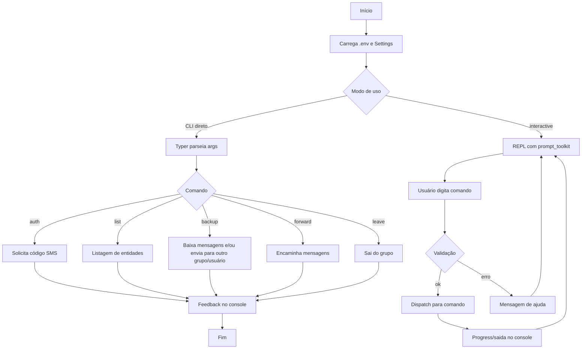
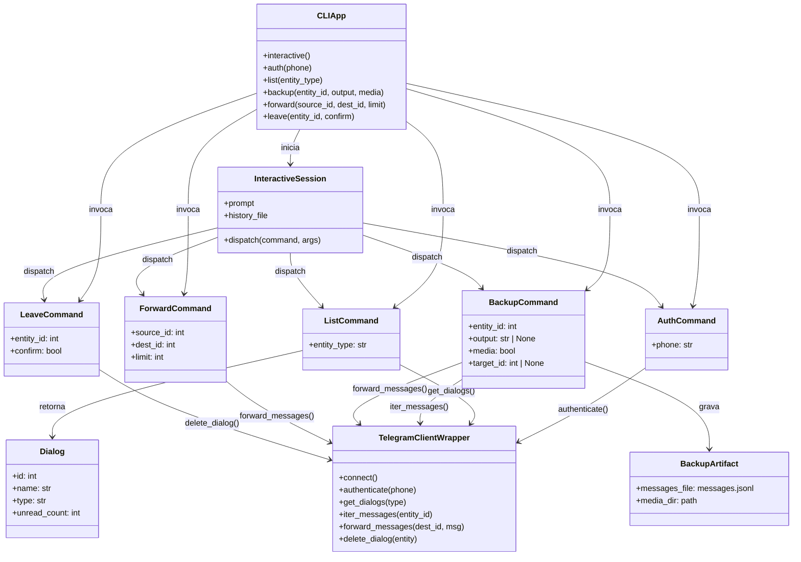

# Diagramas (Mermaid)

## Fluxo UX (CLI)

```mermaid
flowchart TD
    A[Início] --> B[Carrega .env e Settings]
    B --> C{Modo de uso}

    C -->|CLI direto| D[Typer parseia args]
    D --> E{Comando}
    E -->|auth| F[Solicita código SMS]
    E -->|list| G[Listagem de entidades]
    E -->|backup| H[Baixa mensagens e/ou envia para outro grupo/usuário]
    E -->|forward| I[Encaminha mensagens]
    E -->|leave| J[Sai do grupo]
    F --> K[Feedback no console]
    G --> K
    H --> K
    I --> K
    J --> K
    K --> L[Fim]

    C -->|interactive| M[REPL com prompt_toolkit]
    M --> N[Usuário digita comando]
    N --> O{Validação}
    O -->|ok| P[Dispatch para comando]
    O -->|erro| Q[Mensagem de ajuda]
    P --> R[Progress/saida no console]
    Q --> M
    R --> M
```

## Schema: Entidades e Comandos do CLI

```mermaid
classDiagram
    class CLIApp {
        +interactive()
        +auth(phone)
        +list(entity_type)
        +backup(entity_id, output, media)
        +forward(source_id, dest_id, limit)
        +leave(entity_id, confirm)
    }

    class InteractiveSession {
        +prompt
        +history_file
        +dispatch(command, args)
    }

    class AuthCommand {
        +phone: str
    }

    class ListCommand {
        +entity_type: str
    }

    class BackupCommand {
        +entity_id: int
        +output: str | None
        +media: bool
        +target_id: int | None
    }

    class ForwardCommand {
        +source_id: int
        +dest_id: int
        +limit: int
    }

    class LeaveCommand {
        +entity_id: int
        +confirm: bool
    }

    class TelegramClientWrapper {
        +connect()
        +authenticate(phone)
        +get_dialogs(type)
        +iter_messages(entity_id)
        +forward_messages(dest_id, msg)
        +delete_dialog(entity)
    }

    class Dialog {
        +id: int
        +name: str
        +type: str
        +unread_count: int
    }

    class BackupArtifact {
        +messages_file: messages.jsonl
        +media_dir: path
    }

    CLIApp --> AuthCommand : invoca
    CLIApp --> ListCommand : invoca
    CLIApp --> BackupCommand : invoca
    CLIApp --> ForwardCommand : invoca
    CLIApp --> LeaveCommand : invoca
    CLIApp --> InteractiveSession : inicia

    InteractiveSession --> AuthCommand : dispatch
    InteractiveSession --> ListCommand : dispatch
    InteractiveSession --> BackupCommand : dispatch
    InteractiveSession --> ForwardCommand : dispatch
    InteractiveSession --> LeaveCommand : dispatch

    AuthCommand --> TelegramClientWrapper : authenticate()
    ListCommand --> TelegramClientWrapper : get_dialogs()
    BackupCommand --> TelegramClientWrapper : iter_messages()
    BackupCommand --> TelegramClientWrapper : forward_messages()
    ForwardCommand --> TelegramClientWrapper : forward_messages()
    LeaveCommand --> TelegramClientWrapper : delete_dialog()

    ListCommand --> Dialog : retorna
    BackupCommand --> BackupArtifact : grava
```
